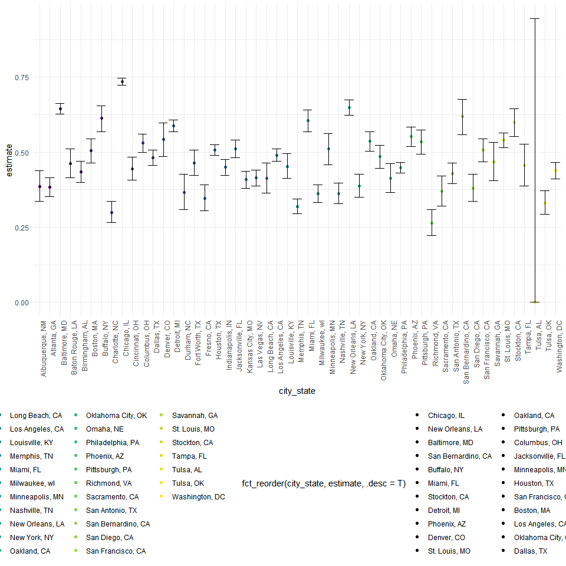

p8105_hw5_as6447
================
Armaan Sodhi
2022-11-11

## Problem 2

1.Describe the raw data.

The raw data includes n=52179 observations with 12 variables. There are
issues with some of the variable names, such as the `lon` variable,
which is actually the longitudinal variable but is incorrectly stated.
Another issue was that that the `city` and `state` are seperate from
each other. These were instead combined together.

``` r
homicide_data = read.csv('data/homicide-data.csv')%>% 
   janitor::clean_names()%>%
   unite('city_state',city:state,remove=FALSE, sep = ', ')%>%
      unite('Victim_full_name',victim_first:victim_last,remove=FALSE, sep = ' ')%>%
   select(-city,-state,-victim_last,-victim_first)%>%
   rename(longitude=lon, latitude=lat)%>%
   mutate(
      unsolved_murder = if_else(disposition %in% c("Closed without arrest","Open/No arrest"),1, 0),
       city_state = replace(city_state, city_state %in% 'Tulsa,AL','Tulsa,OK')
      )
```

We create the `total_number_homicides` variable through the `summarize`
function. The `number_unsolved_murders` variable was created through the
`summarization` function.

``` r
homicide_data1=
homicide_data%>%
   group_by(city_state)%>%
   summarize(
      total_number_homicides=n(),
      number_unsolved_murders = sum(unsolved_murder))
```

`Baltimore_data` was created taking the homicide_data1 data, `filtering`
for only `Baltimore,MD` and then using the `mutate` function to perform
a proportional test using the `map2` function.

``` r
baltimore_data= 
   homicide_data1%>%
   filter(city_state %in% 'Baltimore, MD')%>%
   mutate(p_test = 
             map2(number_unsolved_murders,total_number_homicides, ~prop.test(.x,.y )%>%
                     broom::tidy()))%>%unnest()%>%
   select(city_state,estimate,'CI_lower'=conf.low, 'CI_upper'=conf.high)
```

For the homicide cities section a similar function to the above was
utilized, only this time without the `flter()`function.

``` r
homicide_cities= 
   homicide_data1%>%
   mutate(p_test = map2(number_unsolved_murders,total_number_homicides,~prop.test(.x,.y)%>%broom::tidy()))%>%unnest()%>%
   select(city_state,estimate,'CI_lower' = conf.low, 'CI_upper' = conf.high)
```

``` r
homicide_cities%>%
   ggplot(aes(x=city_state,y=estimate,fill=fct_reorder(city_state,estimate,.desc = T ))) + geom_point(aes(color=city_state)) + geom_errorbar(aes(ymin = CI_lower, ymax = CI_upper ))+theme(axis.text.x = element_text(angle=90, hjust=1))
```



``` r
ggsave='data/homicide_map.pdf'
```

## Problem 3

In this problem, you will conduct a simulation to explore power in a
one-sample t-test.

1.First set the following design elements:

Fix n=30 Fix σ=5 Set μ=0. Generate 5000 datasets from the model

x∼Normal\[μ,σ\]

2.For each dataset, save μ^ and the p-value arising from a test of H:μ=0
using α=0.05.

Hint: to obtain the estimate and p-value, use broom::tidy to clean the
output of t.test.

``` r
set.seed(1)

sim_example = function(n=30, mu, sigma = 5){
   sim_data = 
      tibble(
      x = list(rnorm(n, mean = mu, sd=sigma)))
   return(sim_data)
}

output = tibble()

for (i in 1:5000) {
  output = bind_rows(output, sim_example(mu = 0))
}

t_test_res = output%>%
   mutate(map(.x = x, ~t.test(.x) %>% broom::tidy()))%>%
   unnest()%>%
   select(mu_hat = 'estimate', p.value)
```

3.Repeat the above for μ={1,2,3,4,5,6}, and complete the following:

``` r
output_1 = tibble()

for (i in 1:5000) {
  output_1 = bind_rows(output_1, sim_example(mu = 1),sim_example(mu = 2),sim_example(mu = 3),sim_example(mu = 4),sim_example(mu = 5),sim_example(mu = 6))
}
   
t_test_res_multis = output_1 %>% mutate(map(.x = x, ~t.test(.x) %>% broom::tidy()))%>%unnest()
```

4.Make a plot showing the proportion of times the null was rejected (the
power of the test) on the y axis and the true value of μ on the x axis.
Describe the association between effect size and power.

5.Make a plot showing the average estimate of μ^ on the y axis and the
true value of μ on the x axis. Make a second plot (or overlay on the
first) the average estimate of μ^ only in samples for which the null was
rejected on the y axis and the true value of μ on the x axis. 6.Is the
sample average of μ^ across tests for which the null is rejected
approximately equal to the true value of μ? Why or why not?
